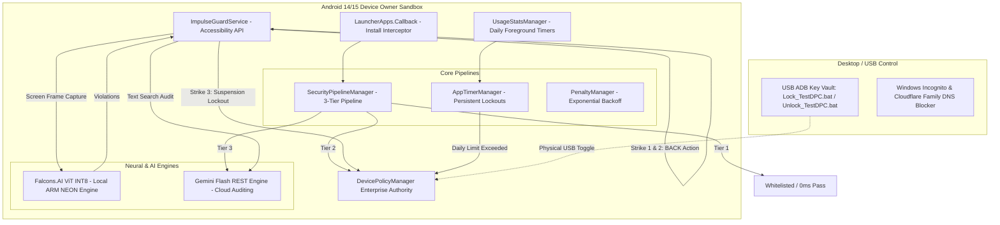
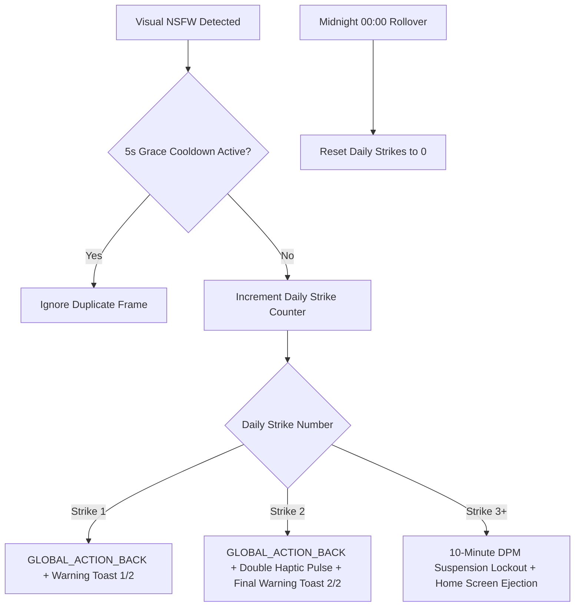
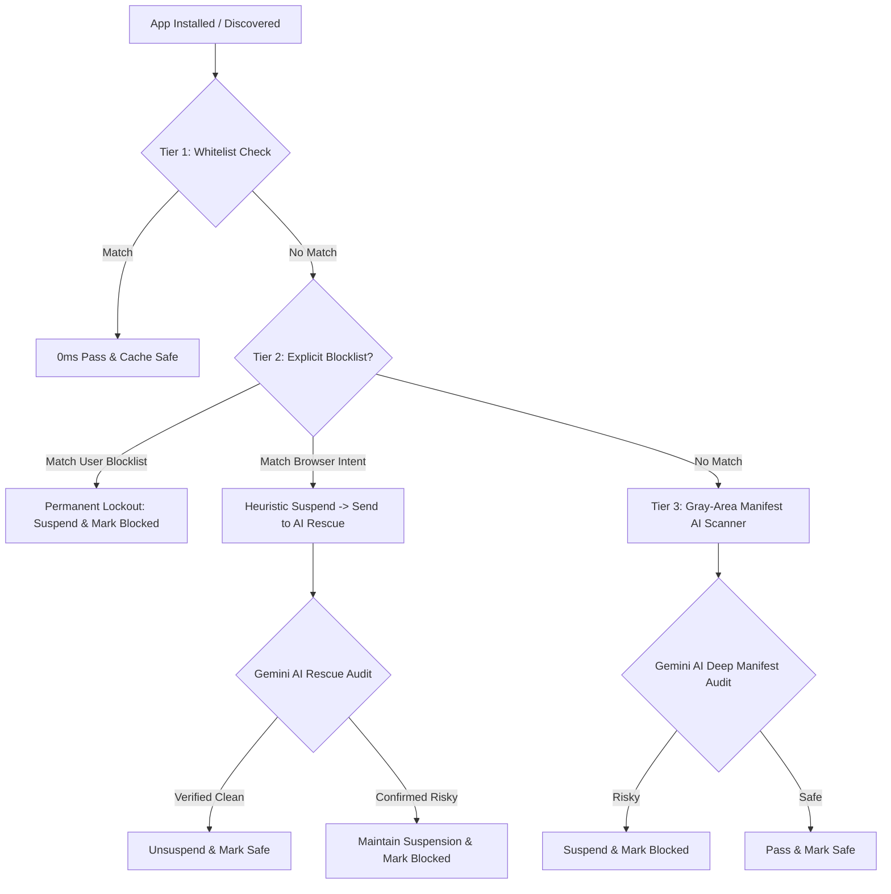

# DPC Locker 🔒 & ImpulseGuard AI System

**Zero-Trust, Impulse-Proof Android Device Owner Security, On-Device Vision Transformer (ViT) Content Moderation, and Cross-Platform Self-Control Engine.**

DPC Locker is an advanced device-level protection system combining **Android Device Owner (DPM) enterprise policies**, **real-time on-device Vision Transformer (ViT) neural inference**, **cloud-assisted Gemini AI app auditing**, **dynamic browser interception**, and **hardened Windows Registry & DNS policies**.

Policy adjustments, app timer modifications, or guard state changes **can only be performed when physically connected to an authorized PC over USB via ADB**.

---

## 📑 Table of Contents

- [DPC Locker 🔒 \& ImpulseGuard AI System](#dpc-locker--impulseguard-ai-system)
  - [📑 Table of Contents](#-table-of-contents)
  - [🏛️ System Architecture Overview](#️-system-architecture-overview)
  - [🧠 1. On-Device Falcons.AI Vision Transformer (ViT) Engine](#-1-on-device-falconsai-vision-transformer-vit-engine)
    - [⚡ Latency \& Performance Engineering](#-latency--performance-engineering)
    - [🎯 Detection Flow](#-detection-flow)
  - [🚨 2. Daily 3-Strike Progressive Warning System](#-2-daily-3-strike-progressive-warning-system)
    - [Disciplinary Flow Matrix](#disciplinary-flow-matrix)
  - [🛡️ 3. ImpulseGuard Sequential Text \& Screen Audit Engine](#️-3-impulseguard-sequential-text--screen-audit-engine)
    - [Phase 1: Search Query Inspection (Pre-Search)](#phase-1-search-query-inspection-pre-search)
    - [Phase 2: Post-Search / Feed Visual Audit](#phase-2-post-search--feed-visual-audit)
    - [Dynamic Penalty Scaling](#dynamic-penalty-scaling)
  - [🔍 4. 3-Tier App Installation \& Boot Optimizer Pipeline](#-4-3-tier-app-installation--boot-optimizer-pipeline)
    - [The 3-Tier Pipeline](#the-3-tier-pipeline)
    - [0ms Boot Optimizer](#0ms-boot-optimizer)
  - [⏱️ 5. Impulse-Proof Daily App Usage Timers](#️-5-impulse-proof-daily-app-usage-timers)
    - [Cross-Guard Suspension Authority](#cross-guard-suspension-authority)
  - [💻 6. Windows PC Protection Architecture](#-6-windows-pc-protection-architecture)
  - [📁 Repository File Tree](#-repository-file-tree)
  - [🔨 Build \& Deployment Instructions](#-build--deployment-instructions)
    - [1. Prerequisites](#1-prerequisites)
    - [2. Building the APK](#2-building-the-apk)
    - [3. Setting up Device Owner via ADB](#3-setting-up-device-owner-via-adb)
    - [4. Enabling Windows PC Protection](#4-enabling-windows-pc-protection)
  - [🐞 Debugging \& Troubleshooting Guide](#-debugging--troubleshooting-guide)
    - [Real-Time Logcat Inspection](#real-time-logcat-inspection)
    - [Inspecting Internal State \& Caches via ADB](#inspecting-internal-state--caches-via-adb)
    - [Manual Override / Reset Commands](#manual-override--reset-commands)

---

## 🏛️ System Architecture Overview



---

## 🧠 1. On-Device Falcons.AI Vision Transformer (ViT) Engine

[`FalconsVisionGuardEngine.java`](testdpc_source/app/src/main/java/com/afwsamples/testdpc/FalconsVisionGuardEngine.java) executes an on-device quantized **Vision Transformer (ViT)** neural network powered by **Microsoft ONNX Runtime** (`com.microsoft.onnxruntime:onnxruntime-android:1.17.0`).

### ⚡ Latency & Performance Engineering

Scanning a live $1080 \times 2400$ OLED display on a mobile CPU previously required ~1400ms. Through hardware-level optimizations, end-to-end latency was reduced to **~430ms**:

1. **Direct `HardwareBuffer` Slicing:**
   * Instead of copying an uncompressed $1080 \times 2400$ 32-bit ARGB software bitmap (a $10.36\text{ MB}$ raw allocation), the system downscales directly from the GPU `HardwareBuffer` to $224 \times 224$ ($0.2\text{ MB}$), eliminating 950ms of memory bus overhead.
2. **$O(1)$ Static Normalization Look-Up Table (`NORM_LUT`):**
   * Replaced 150,528 floating-point division and subtraction operations per frame with a pre-computed 256-element lookup table for ImageNet normalization (`(pixel / 255.0 - mean) / std`).
3. **Zero-GC Memory Allocation Pooling:**
   * Uses `ThreadLocal<float[]>` and `ThreadLocal<int[]>` reusable memory buffers. Heap churn during live screen inference is **0 bytes**, preventing Android garbage collection (GC) stutter.
4. **4-Thread ARM NEON Vector SIMD Acceleration:**
   * Configured `OrtSession` with 4 intra-op threads utilizing ARM NEON vector instructions (`MatMulInteger` acceleration). Pure inference execution finishes in **~130–140ms**.

### 🎯 Detection Flow

* **Model:** `falconsai_nsfw_image_detection_quantized.onnx` (stored in `assets/models/`).
* **Input Size:** $1 \times 3 \times 224 \times 224$ (NCHW format, RGB normalized).
* **Output:** 2 Logits (`[Normal, NSFW]`) $\rightarrow$ Softmax probability distribution.
* **Cutoff Threshold:** Configurable via UI (`35%` Ultra, `70%` Standard, or custom $20\%-90\%$).
* **Target Monitored Apps:** Instagram, YouTube/ReVanced, Reddit, Browsers, Video Downloaders, etc.

---

## 🚨 2. Daily 3-Strike Progressive Warning System

Implemented in [`ImpulseGuardService.java`](testdpc_source/app/src/main/java/com/afwsamples/testdpc/ImpulseGuardService.java), the system enforces progressive disciplinary actions when visual NSFW content is detected:



### Disciplinary Flow Matrix

| Strike | Trigger Condition | System Action | Haptics | Notification Toast |
| :---: | :---: | :---: | :---: | :--- |
| **Strike 1** | 1st NSFW frame of the day | `GLOBAL_ACTION_BACK` (Exits content/reel) | None | `⚠️ Content Warning (1/2) - Exiting content` |
| **Strike 2** | 2nd NSFW frame of the day | `GLOBAL_ACTION_BACK` (Exits content/reel) | Double Pulse | `🚨 Final Warning (2/2) - Next violation locks app` |
| **Strike 3** | 3rd+ NSFW frame of the day | `dpm.setPackagesSuspended(..., true)` + `GLOBAL_ACTION_HOME` | Long Pulse | `🔒 Content Blocked - App locked for 10 minutes` |

* **5-Second Grace Cooldown:** Prevents multi-frame detections of the same video/post during screen transitions from burning multiple strikes.
* **Midnight Automatic Rollover:** Strikes reset to `0` daily at `00:00`.
* **Administrative Reset:** Includes a `🔄 Reset Today's Strikes to 0` button in Test DPC settings for manual testing.

---

## 🛡️ 3. ImpulseGuard Sequential Text & Screen Audit Engine

[`ImpulseGuardService.java`](testdpc_source/app/src/main/java/com/afwsamples/testdpc/ImpulseGuardService.java) monitors search boxes, suggestions, and feed displays:

### Phase 1: Search Query Inspection (Pre-Search)
1. **Debounced Typing Capture:** Captures typed search text with a 1200ms debounce pause after typing ceases, or instantly upon tapping a search button/suggestion.
2. **0ms Local Risky Cache:** Evaluates search queries against a local database of known violations in `0ms`.
3. **Cloud Gemini Flash API:** If not cached, queries Gemini Flash with strict binary JSON output (`is_risky: true/false`).
4. **Immediate Action:** If risky, cancels search, ejects to Home Screen (`GLOBAL_ACTION_HOME`), and suspends the target app.

### Phase 2: Post-Search / Feed Visual Audit
* If a search query is allowed, the engine schedules a visual audit 400ms later to scan the resulting feed using the on-device ViT engine.

### Dynamic Penalty Scaling
Managed by [`PenaltyManager.java`](testdpc_source/app/src/main/java/com/afwsamples/testdpc/PenaltyManager.java):
* **Violation 1:** 10 minutes suspension.
* **Violation 2:** 30 minutes suspension.
* **Violation 3:** 60 minutes suspension.
* **Violation 4+:** 120 minutes suspension.

---

## 🔍 4. 3-Tier App Installation & Boot Optimizer Pipeline

Managed by [`SecurityPipelineManager.java`](testdpc_source/app/src/main/java/com/afwsamples/testdpc/SecurityPipelineManager.java), every newly installed app or system boot is processed through a deterministic 3-tier pipeline:

### The 3-Tier Pipeline



1. **Tier 1: User Whitelist Override (0ms):**
   * Checks [`SecurityConfig.java`](testdpc_source/app/src/main/java/com/afwsamples/testdpc/SecurityConfig.java). Core packages (`WhatsApp`, `AnkiDroid`, `Duolingo`, `ReVanced`, `Phone`, `Settings`) pass instantly.
2. **Tier 2: Deterministic Fast-Path (<2ms):**
   * **Explicit Blocklist (Hard Block):** Notorious apps (`TikTok`, `Twitter/X`, `Reddit`, `Tumblr`, `Telegram`, `YouTube`) are suspended immediately and **never sent to AI rescue**.
   * **Heuristic Browser Match:** Apps claiming generic `http://` or `https://` `BROWSABLE` intents without an explicit category are provisionally suspended and sent to background AI rescue verification.
3. **Tier 3: Gray-Area Deep Manifest AI Scanner:**
   * [`AiAppAuditor.java`](testdpc_source/app/src/main/java/com/afwsamples/testdpc/AiAppAuditor.java) extracts package manifest metadata (permissions, activities, receivers) and audits the app via Gemini Flash to identify hidden porn browsers or video downloaders.

### 0ms Boot Optimizer
* On device boot, cached packages in `dpclocker_package_state_cache.xml` are verified in `0ms` without re-running network calls.
* **Safe-Cache Write Protection:** Explicitly blocklisted apps can never be written to `cache_verified_safe_packages`.

---

## ⏱️ 5. Impulse-Proof Daily App Usage Timers

Managed by [`AppTimerManager.java`](testdpc_source/app/src/main/java/com/afwsamples/testdpc/AppTimerManager.java) and [`AppTimerReceiver.java`](testdpc_source/app/src/main/java/com/afwsamples/testdpc/AppTimerReceiver.java):

1. **Native OS Observers:**
   * Uses Android's `UsageStatsManager.registerAppUsageObserver()` API to track foreground runtime with **0% battery/CPU drain**.
2. **Persistent Daily Lockouts:**
   * When an app reaches its limit (e.g., 20 mins for Instagram), Android triggers `ACTION_LIMIT_EXCEEDED`.
   * The app is suspended via DPM, and a persistent record `exceeded_today_[pkg] = [YYYYMMDD]` is saved.
3. **High-Precision Foreground Tracking:**
   * Calculates usage with `UsageStatsManager.queryAndAggregateUsageStats(startTime, endTime)` for exact millisecond accuracy.
4. **Anti-Tamper Lock:**
   * Apps with configured timers have `dpm.setUninstallBlocked(admin, pkg, true)` automatically enforced.
5. **Midnight Rollover:**
   * At `00:00`, `ACTION_MIDNIGHT_RESET` clears daily exceeded flags, re-registers observers, and unsuspends apps for the new day.

### Cross-Guard Suspension Authority
`ImpulseGuardService` and `SecurityPipelineManager` check `AppTimerManager.isDailyLimitExceeded()` before un-suspending any app. **No 10-minute AI penalty cleanup or policy sync will ever unsuspend an app that has exceeded its daily usage limit.**

---

## 💻 6. Windows PC Protection Architecture

Configured via [`enable_windows_protection.ps1`](enable_windows_protection.ps1) and [`enable_windows_protection.reg`](enable_windows_protection.reg):

1. **Browser Incognito & InPrivate Lock:**
   * Google Chrome: `IncognitoModeAvailability` = `1` (Disabled).
   * Microsoft Edge: `InPrivateModeAvailability` = `1` (Disabled).
   * Brave Browser: `IncognitoModeAvailability` = `1` (Disabled).
2. **Network Direct Lockdown (`ProxyMode = "direct"`):**
   * Enforces direct browser connections, preventing proxy/VPN extensions from rerouting traffic.
3. **Cloudflare Family DNS over HTTPS (DoH):**
   * Forces CleanBrowsing / Cloudflare Family DNS (`1.1.1.3` / `security.cloudflare-dns.com`) at both OS and browser levels.
4. **SafeSearch & Adult Domain Redirection (`hosts` file):**
   * Maps Google and Bing to Strict SafeSearch VIPs (`216.239.38.120`).
   * Maps notorious adult and proxy domains (`x.com`, `reddit.com`, `croxyproxy.com`, etc.) to `0.0.0.0`.
5. **Windows VPN & Adapter Lock:**
   * Disables VPN configuration in Windows Settings (`DISALLOW_CONFIG_VPN`).
   * Disables the Windows Remote Access Connection Manager (`RasMan`) service.

---

## 📁 Repository File Tree

```text
├── TestDPC.apk                           # Pre-compiled, ready-to-deploy Device Owner APK
├── build_merged_dpc.ps1                  # 1-Click PowerShell script to compile APK
├── Lock_TestDPC.bat                      # 1-Click USB ADB script: Lock Test DPC UI
├── Unlock_TestDPC.bat                    # 1-Click USB ADB script: Unlock Test DPC UI
├── Enable_Windows_Protection.bat         # 1-Click admin script for Windows PC policies
├── enable_windows_protection.ps1         # Windows PowerShell security configuration
├── enable_windows_protection.reg         # Windows Registry policy template
├── testdpc_source/                       # Complete Android Source Code
│   └── app/src/main/
│       ├── assets/models/                # ONNX Quantized Neural Network Models
│       │   └── falconsai_nsfw_image_detection_quantized.onnx
│       └── java/com/afwsamples/testdpc/
│           ├── FalconsVisionGuardEngine.java # On-Device ViT ONNX Runtime Inference Engine
│           ├── ImpulseGuardService.java      # Accessibility Service, 3-Strike Handler, Screen Capture
│           ├── SecurityPipelineManager.java  # 3-Tier Interception & 0ms Boot Optimizer
│           ├── SecurityConfig.java           # Central Vault (API Keys, Whitelists, Blocklists)
│           ├── SecurityLogger.java           # Local Circular Security Audit Logger
│           ├── AiAppAuditor.java             # Gemini Flash REST Manifest Scanner & False-Positive Rescue
│           ├── AppTimerManager.java          # Persistent Daily App Limits & Usage Tracking
│           ├── AppTimerReceiver.java         # AlarmManager Midnight Reset & Limit Handler
│           ├── BrowserBlocker.java           # Dynamic BROWSABLE Intent Interceptor
│           ├── NotoriousAppBlocker.java      # Hard Blocklist Enforcement Engine
│           ├── PenaltyManager.java           # Progressive Penalty Duration Calculator
│           ├── PolicyManagementActivity.java # Main Activity with USB ADB Lock Guard
│           ├── DeviceAdminReceiver.java      # Device Administrator & Owner Component
│           └── policy/
│               └── PolicyManagementFragment.java # Settings UI, Strike Badge, Timer Dialogs
└── README.md                             # Complete Engineering Documentation
```

---

## 🔨 Build & Deployment Instructions

### 1. Prerequisites
* **Android Device:** Android 9.0+ (Tested on Android 14/15, Google Pixel 6 Pro).
* **Development Environment:** Android Studio Jellyfish/Koala or JDK 17+.
* **Android SDK Platform Tools:** `adb` installed and accessible in system PATH.

### 2. Building the APK

Run the automated PowerShell build script:
```powershell
powershell -ExecutionPolicy Bypass -File "build_merged_dpc.ps1"
```
The compiled APK will be output to:
`testdpc_source\app\build\outputs\apk\normal\debug\TestDPC-normal-debug.apk` and copied to the root directory as `TestDPC.apk`.

### 3. Setting up Device Owner via ADB

1. Factory reset your Android device or remove all Google accounts from Settings.
2. Install the APK:
   ```bash
   adb install -r TestDPC.apk
   ```
3. Set Test DPC as Device Owner:
   ```bash
   adb shell dpm set-device-owner com.afwsamples.testdpc/.DeviceAdminReceiver
   ```
4. Enable the ImpulseGuard Accessibility Service:
   ```bash
   adb shell settings put secure enabled_accessibility_services com.afwsamples.testdpc/com.afwsamples.testdpc.ImpulseGuardService
   ```

### 4. Enabling Windows PC Protection

Right-click `Enable_Windows_Protection.bat` and select **Run as Administrator**.

---

## 🐞 Debugging & Troubleshooting Guide

### Real-Time Logcat Inspection

Filter logs for all DPC Locker subsystems:
```bash
adb logcat -v time -s FalconsVision:V ImpulseGuardService:V SecurityPipeline:V AiAppAuditor:V AppTimerManager:V AppTimerReceiver:V SecurityLogger:V
```

### Inspecting Internal State & Caches via ADB

Read the live Security Audit Log:
```bash
adb shell "run-as com.afwsamples.testdpc cat /data/user/0/com.afwsamples.testdpc/shared_prefs/dpclocker_security_logs.xml"
```

Inspect the 0ms Package State Cache:
```bash
adb shell "run-as com.afwsamples.testdpc cat /data/user/0/com.afwsamples.testdpc/shared_prefs/dpclocker_package_state_cache.xml"
```

Inspect Active App Daily Timers and Exceeded Flags:
```bash
adb shell "run-as com.afwsamples.testdpc cat /data/user/0/com.afwsamples.testdpc/shared_prefs/dpclocker_app_timers.xml"
```

### Manual Override / Reset Commands

Simulate Midnight Reset (Resets strikes & app timers):
```bash
adb shell am broadcast -a com.afwsamples.testdpc.ACTION_MIDNIGHT_RESET -p com.afwsamples.testdpc
```

Unlock Test DPC UI for Maintenance via USB:
```bash
Unlock_TestDPC.bat
```

Lock Test DPC UI via USB:
```bash
Lock_TestDPC.bat
```
