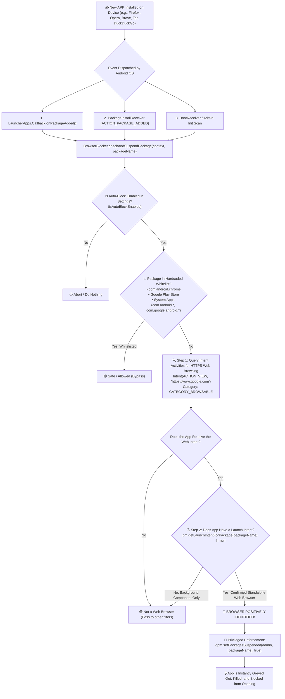

# Comprehensive Analysis: Web Browser Installation Detection in Test DPC

This document provides an in-depth technical explanation of how **Test DPC / DpcLocker** detects and neutralizes newly installed third-party web browsers on Android in real time.

---

## 1. Executive Summary & Core Concept

Android does not have an explicit `isBrowser()` API method. Instead, the Android OS identifies web browsers based on **Intent Resolution**—specifically, whether an application advertises to the operating system that it can handle generic web browsing intents (`http://` and `https://` URLs).

Test DPC leverages a **multi-stage detection pipeline**:
1. **Real-Time Event Hooking:** Intercepts package installation events via both the modern `LauncherApps.Callback` system service and `BroadcastReceiver` manifests.
2. **Intent Filter Querying:** Asks the Android `PackageManager` whether the newly installed package declares the ability to view browsable HTTPS web pages.
3. **Launcher Activity Verification:** Verifies that the app has a user-facing launch icon (distinguishing standalone browsers from internal system helper libraries).
4. **Whitelisting Guard:** Protects Google Chrome and core Android system services from being flagged.
5. **Privileged Device Owner Enforcement:** Instantly suspends (greys out and disables) the detected browser via `DevicePolicyManager.setPackagesSuspended()`.

---

## 2. Complete Detection Workflow



---

## 3. Deep Dive into the Code Components

### Component 1: Real-Time Event Hooking (`LauncherApps.Callback`)

In `BrowserBlocker.java`, the system registers a persistent callback with Android's `LauncherApps` system service:

```java
LauncherApps launcherApps = (LauncherApps) context.getSystemService(Context.LAUNCHER_APPS_SERVICE);
if (launcherApps != null) {
    launcherApps.registerCallback(new LauncherApps.Callback() {
        @Override
        public void onPackageAdded(String packageName, UserHandle user) {
            Log.i(TAG, "LauncherApps onPackageAdded: " + packageName);
            checkAndSuspendPackage(context, packageName);
            AppTimerManager.checkAndEnforceLimits(context);
            NotoriousAppBlocker.checkAndSuspendNotoriousPackage(context, packageName);
            AiAppAuditor.checkAndAuditPackage(context, packageName);
        }
        // ...
    });
}
```

#### Why `LauncherApps.Callback` is Used:
* **Instant Execution:** In modern Android (Android 8.0 Oreo through Android 15), implicit broadcast receivers are heavily restricted in the background. `LauncherApps.Callback` is a privileged system listener that fires with **zero delay** the exact millisecond package installation completes.

---

### Component 2: The Intent Resolution Check (`isNonChromeBrowser`)

The core logic that identifies a web browser resides in `BrowserBlocker.java` (lines 89–130):

```java
public static boolean isNonChromeBrowser(Context context, String packageName) {
    if (packageName == null || packageName.isEmpty()) {
        return false;
    }

    // 1. Hardcoded Whitelist for Chrome and Core System Apps
    if ("com.android.chrome".equals(packageName) ||
        "com.google.android.googlequicksearchbox".equals(packageName) ||
        "com.android.vending".equals(packageName) ||
        "com.custom.dpclocker".equals(packageName) ||
        "com.afwsamples.testdpc".equals(packageName) ||
        packageName.startsWith("com.google.android.") ||
        packageName.startsWith("com.android.")) {
        return false;
    }

    PackageManager pm = context.getPackageManager();

    // 2. Query for Generic Browsable Web Handlers
    boolean handlesWebIntent = false;
    try {
        Intent webIntent = new Intent(Intent.ACTION_VIEW, Uri.parse("https://www.google.com"));
        webIntent.addCategory(Intent.CATEGORY_BROWSABLE);

        List<ResolveInfo> resolveInfos = pm.queryIntentActivities(webIntent, PackageManager.MATCH_ALL);
        if (resolveInfos != null) {
            for (ResolveInfo info : resolveInfos) {
                if (info.activityInfo != null && packageName.equals(info.activityInfo.packageName)) {
                    // 3. Verify it is a user-facing launcher application
                    Intent launchIntent = pm.getLaunchIntentForPackage(packageName);
                    if (launchIntent != null) {
                        handlesWebIntent = true;
                        Log.i(TAG, "Package " + packageName + " confirmed as generic Web Browser intent handler");
                        break;
                    }
                }
            }
        }
    } catch (Exception ignored) {
    }

    return handlesWebIntent;
}
```

---

## 4. How the Two-Factor Verification Works

### Factor 1: Intent Handler Matching (`ACTION_VIEW` + `CATEGORY_BROWSABLE`)

When any web browser is developed for Android, its developer must declare an `<intent-filter>` inside its `AndroidManifest.xml` so the operating system knows it can open web links:

```xml
<!-- Typical Browser Manifest Intent Filter -->
<intent-filter>
    <action android:name="android.intent.action.VIEW" />
    <category android:name="android.intent.category.DEFAULT" />
    <category android:name="android.intent.category.BROWSABLE" />
    <data android:scheme="http" />
    <data android:scheme="https" />
</intent-filter>
```

When Test DPC runs:
```java
Intent webIntent = new Intent(Intent.ACTION_VIEW, Uri.parse("https://www.google.com"));
webIntent.addCategory(Intent.CATEGORY_BROWSABLE);
List<ResolveInfo> resolveInfos = pm.queryIntentActivities(webIntent, PackageManager.MATCH_ALL);
```
Android's `PackageManager` queries the internal OS routing table and returns **every application installed on the phone that is capable of opening `https://www.google.com`**.
* If a newly installed app is **Firefox, Opera, Brave, Edge, Tor, UC Browser, or DuckDuckGo**, it will be returned in `resolveInfos`.
* If a newly installed app is **Calculator, WhatsApp, Spotify, or a Game**, it will **not** be returned because it does not declare a generic HTTPS browsable filter.

---

### Factor 2: User Launch Intent Verification (`getLaunchIntentForPackage`)

Some non-browser apps (such as payment SDKs or OAuth authentication helpers) might declare browsable intents for internal callback redirects.

To ensure **false positives are eliminated**, Test DPC applies a second verification:
```java
Intent launchIntent = pm.getLaunchIntentForPackage(packageName);
```
* If an app has a launcher icon that the user can tap from the home screen (`launchIntent != null`) **AND** it handles generic HTTPS links, it is definitively a **standalone, interactive web browser**.

---

## 5. What Happens When a Browser is Detected?

Once `isNonChromeBrowser()` evaluates to `true`, the enforcement method executes immediately:

```java
public static void checkAndSuspendPackage(Context context, String packageName) {
    if (!isAutoBlockEnabled(context)) {
        return;
    }
    if (isNonChromeBrowser(context, packageName)) {
        try {
            DevicePolicyManager dpm = (DevicePolicyManager) context.getSystemService(Context.DEVICE_POLICY_SERVICE);
            if (dpm != null && dpm.isDeviceOwnerApp(context.getPackageName())) {
                dpm.setPackagesSuspended(DeviceAdminReceiver.getComponentName(context), new String[]{packageName}, true);
                Log.i(TAG, "SUCCESSFULLY DYNAMICALLY AUTO-SUSPENDED NON-CHROME BROWSER: " + packageName);
            }
        } catch (Exception e) {
            Log.e(TAG, "Error suspending package " + packageName, e);
        }
    }
}
```

### OS-Level Effects of `setPackagesSuspended(..., true)`:
1. **Immediate Execution Freeze:** The app cannot be launched. If the user tries to open it, Android displays an administrative dialog: *"This app is paused by your administrator"*.
2. **Visual Greying Out:** The app's icon on the home screen and app drawer turns translucent grey.
3. **Intent Blackholing:** If any other app tries to send a URL to the blocked browser, the OS ignores the blocked browser and routes the request exclusively to **Google Chrome** (which is managed and filtered).

---

## 6. Full Boot & Periodic Scanning Guard

In addition to intercepting live installs, Test DPC ensures that no browser can survive a device reboot or sideload while the device was powered off.

In `DeviceAdminReceiver.java`:
```java
if (intent != null && intent.getAction() != null) {
    if (Intent.ACTION_BOOT_COMPLETED.equals(intent.getAction())) {
        BrowserBlocker.scanAndSuspendAllBrowsers(context);
    }
}
```

And in `BrowserBlocker.java`:
```java
public static void scanAndSuspendAllBrowsers(Context context) {
    if (!isAutoBlockEnabled(context)) return;
    try {
        DevicePolicyManager dpm = (DevicePolicyManager) context.getSystemService(Context.DEVICE_POLICY_SERVICE);
        if (dpm == null || !dpm.isDeviceOwnerApp(context.getPackageName())) return;

        PackageManager pm = context.getPackageManager();
        List<ApplicationInfo> apps = pm.getInstalledApplications(0);
        for (ApplicationInfo app : apps) {
            if (isNonChromeBrowser(context, app.packageName)) {
                dpm.setPackagesSuspended(DeviceAdminReceiver.getComponentName(context), new String[]{app.packageName}, true);
                Log.i(TAG, "AUTO-SUSPENDED NON-CHROME BROWSER ON SCAN: " + app.packageName);
            }
        }
    } catch (Exception e) {
        Log.e(TAG, "Error in scanAndSuspendAllBrowsers", e);
    }
}
```

---

## 7. Secondary Defense Layer: `AiAppAuditor`

What if a shady app disguises itself as a "Utility" or "File Manager" but actually contains a built-in unmanaged browser or video downloader (e.g. VidMate, Snaptube)?

`BrowserBlocker` hands the package over to **`AiAppAuditor.java`**, which:
1. Extracts the app's requested permissions (`INTERNET`, storage access).
2. Extracts all declared activities searching for `WebView`, `Browser`, `Download`, and `MediaFetch`.
3. Passes the metadata to **Gemini AI** to detect stealth browsers.
4. Uses a **Structural Fallback Guard** if offline:
   $$\text{Has INTERNET} \land \text{Has STORAGE} \land \text{Has WebView/Downloader Activity} \implies \text{AUTO-SUSPEND}$$

---

## 8. Summary Table of Browser Detection Metrics

| Feature | Implementation | Purpose |
|---|---|---|
| **Trigger Mechanism** | `LauncherApps.Callback.onPackageAdded` + `PackageInstallReceiver` | Instant 0ms detection when user installs an APK. |
| **Detection Method** | `pm.queryIntentActivities(ACTION_VIEW, 'https://google.com')` | Dynamic intent check matching any app capable of web browsing. |
| **Anti-False Positive** | `pm.getLaunchIntentForPackage(packageName) != null` | Ensures background services or payment SDKs are not blocked. |
| **Whitelisted Browser** | `com.android.chrome` | Google Chrome is permitted because it is locked down via Enterprise Policies. |
| **Enforcement** | `DevicePolicyManager.setPackagesSuspended(true)` | Hardware-level OS suspension (app is killed & greyed out). |
| **Boot Persistence** | `scanAndSuspendAllBrowsers` on `BOOT_COMPLETED` | Scans entire device on boot to catch offline installations. |
